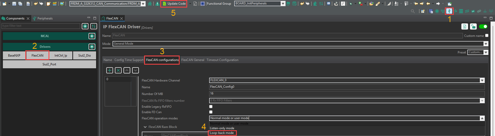
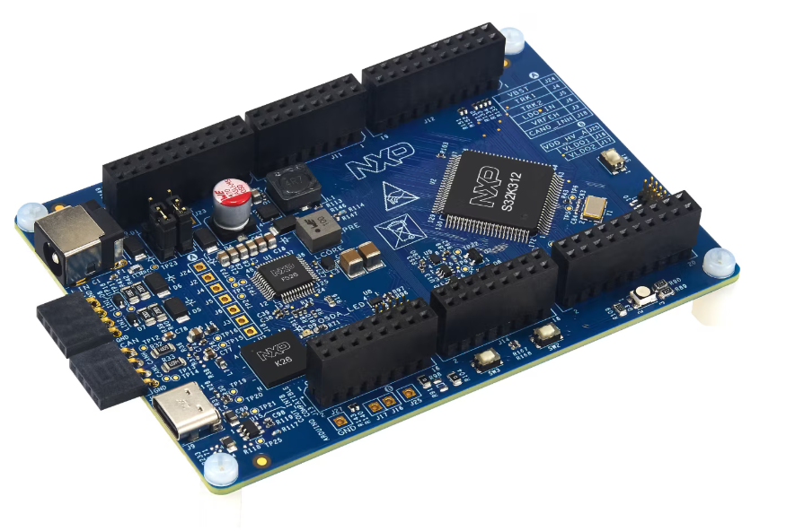
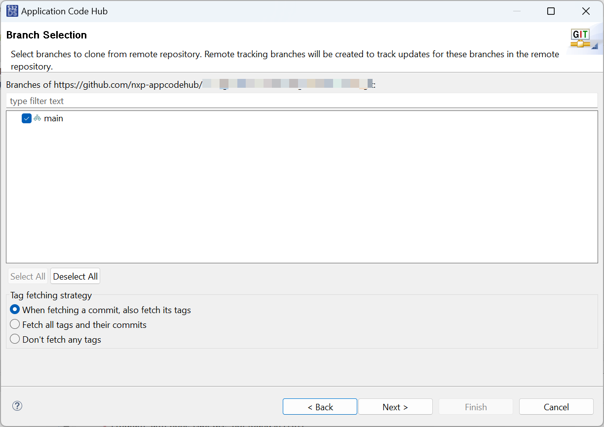
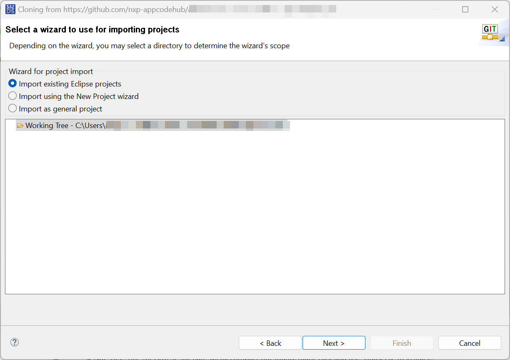
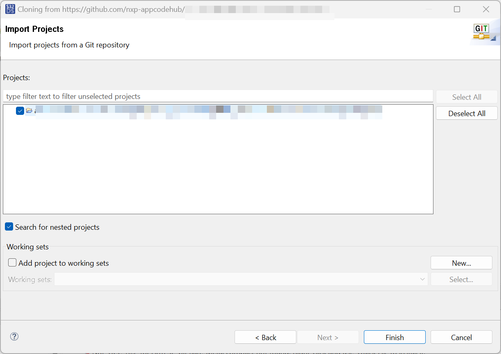
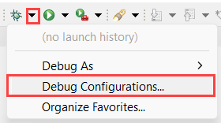

# NXP Application Code Hub
[](https://www.nxp.com)

## CAN Communication using FRDM-A-S32K312
This project implements a configurable CAN communication node that operates in three selectable modes—Transmit (TX), Receive (RX), and Loopback—controlled at build time through compile‑time macros. By defining one of the mode macros in the project configuration, the firmware conditionally compiles the appropriate behavior without changing source code.
```c
/* Choose which mode by assigning a 1U to the desired macro */
#define CAN_TX_NODE 				(1U)    /* CAN_TX_NODE is chosen */
#define CAN_RX_NODE				    (0U)
#define CAN_LOOPBACK_MODE			(0U)
```

TX Node Mode (CAN_TX_NODE): Periodically transmits CAN frames (standard/extended IDs supported) with configurable payloads and timing.
RX Node Mode (CAN_RX_NODE): Listens on the CAN bus, filters frames by ID/mask. 
Loopback Mode (CAN_LOOPBACK_MODE): Enables controller internal loopback to validate CAN initialization, bitrate, filters, and ISR paths without external bus hardware, providing a fast self‑test for bring‑up.

>*NOTE:* To configure the example in Loopback mode, Loopback mode must be set on the driver configurations following the steps:
1. Click on the Peripheral symbol to change to the Peripherals perspctive.
2. Select the FlexCAN driver on the Drivers section.
3. Click on the FlexCAN Configurations tab.
4. On FlexCAN Operation modes, select Loop-back mode.
5. Click on Update Code.
[<p align="center"></p>](./images/Loopback_mode_configuration.png)

#### Boards: FRDM-A-S32K312
#### Categories: Communication
#### Peripherals: FlexCAN, Siul2
#### Toolchains: S32 Design Studio IDE

## Table of Contents
1. [Software and Tools](#step1)
2. [Hardware](#step2)
3. [Setup](#step3)
4. [Results](#step4)
5. [Support](#step6)
6. [Release Notes](#step7)

## 1. Software and Tools<a name="step1"></a>
This example was developed using the FRDM Automotive Bundle for S32K3. To download and install the complete software and tools ecosystem, use the following link:
[S32K3 FRDM Automotive Board Installation Package](https://www.nxp.com/app-autopackagemgr/automotive-software-package-manager:AUTO-SW-PACKAGE-MANAGER?currentTab=0&selectedDevices=S32K3&applicationVersionID=156)

## 2. Hardware<a name="step2"></a>
### 2.1 Required Hardware
- Personal Computer
- Type-C USB cable
- [FRDM-A-S32K312](https://www.nxp.com/design/design-center/development-boards-and-designs/S32K312MINI-EVB)[<p align="center"></p>](images/S32K312MINI-EVB.png)


### 2.3 Debugger Connection
- Connect the FRDM-A-S32K312 board to your Personal Computer using the Type-C USB cable

## 3. Setup<a name="step3"></a>

### 3.1 Import the Project into S32 Design Studio IDE
1. Open S32 Design Studio IDE, in the Dashboard Panel, choose **Import project from Application Code Hub**.
[<p align="center"></p>](./images/import_project_1.png)

2. You can find the demo you need by searching for the name directly. Open the project, click the **GitHub link** from this window, S32 Design Studio IDE will automatically retrieve project attributes then click **Next>**.
[<p align="center"></p>](./images/import_project_3.png)

3. Select **main** branch and then click **Next>**.
[<p align="center"></p>](./images/import_project_4.png)

4. Select your local path for the repo in **Destination->Directory:** window. The S32 Design Studio IDE will clone the repo into this path, click **Next>**.
[<p align="center"></p>](./images/import_project_5.png)

5. Select **Import existing Eclipse projects** then click **Next>**.
[<p align="center"></p>](./images/import_project_6.png)

6. Select the project in this repo (only one project in this repo) then click **Finish**.
[<p align="center"></p>](./images/import_project_7.png)

### 3.2 Generating, Building and Running the Example
1. In Project Explorer, right-click the project and select **Update Code and Build Project**. This will generate the configuration (Pins, Clocks, Peripherals), update the source code and build the project using the active configuration (e.g. Debug_FLASH). Make sure the build completes successfully and the *.elf file is generated without errors.
[<p align="center"></p>](./images/UpdateCodeAndBuildProject.png)
Press **Yes** in the **SDK Component Management** pop-up window to continue.

2. Go to **Debug** and select **Debug Configurations**. Select **GDB PEMicro Interface Debugging**:
[<p align="center"></p>](./images/DebugConfigurations.png)

Use the controls to control the program flow.

## 4. Results<a name="step4"></a>
When one board is connected as receiver and another one is connected as transmitter, the BLUE LED will activate on the transmitter board when the CAN Messages are being sent, on the receiver board, the GREEN LED will activate when the message was successfully received, otherwise the RED LED will light up.


## 5. Support<a name="step6"></a>
For general technical questions related to NXP microcontrollers, please use the *[NXP Community Forum](https://community.nxp.com/)*.
#### Project Metadata

<!----- Boards ----->
[]()

<!----- Peripherals ----->
[]()
[]()

<!----- Toolchains ----->
[](https://mcuxpresso.nxp.com/appcodehub?toolchain=s32_design_studio_ide)

Questions regarding the content/correctness of this example can be entered as Issues within this GitHub repository.

>**Warning**: For more general technical questions regarding NXP Microcontrollers and the difference in expected functionality, enter your questions on the [NXP Community Forum](https://community.nxp.com/)

[](https://www.youtube.com/NXP_Semiconductors)
[](https://www.linkedin.com/company/nxp-semiconductors)
[](https://www.facebook.com/nxpsemi/)
[](https://x.com/NXP)


## 6. Release Notes<a name="step7"></a>
| Version | Description / Update                           | Date                        |
|:-------:|------------------------------------------------|----------------------------:|
| 1.0     | Initial release on Application Code Hub        |February 24<sup>th</sup> 2026|